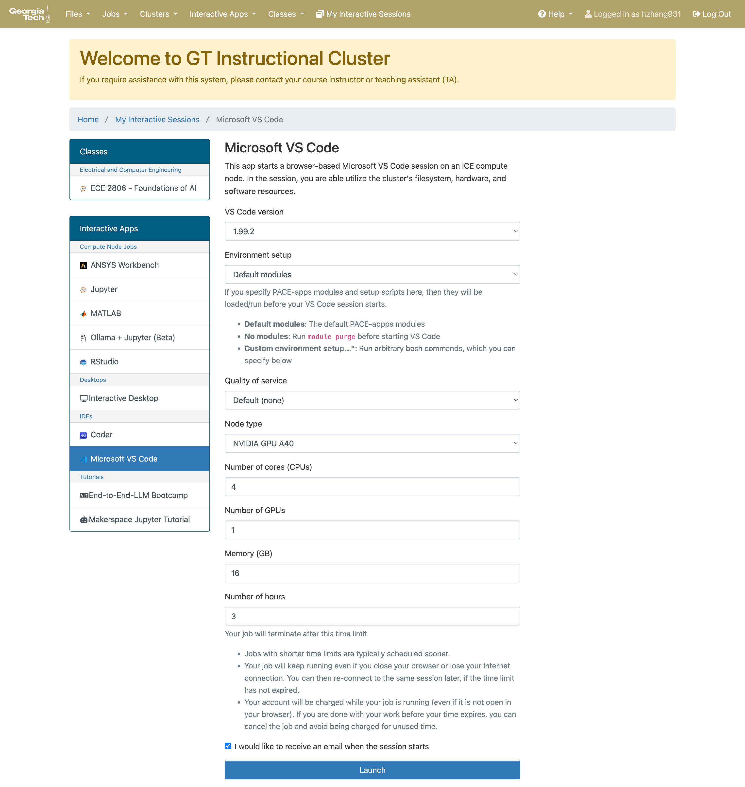
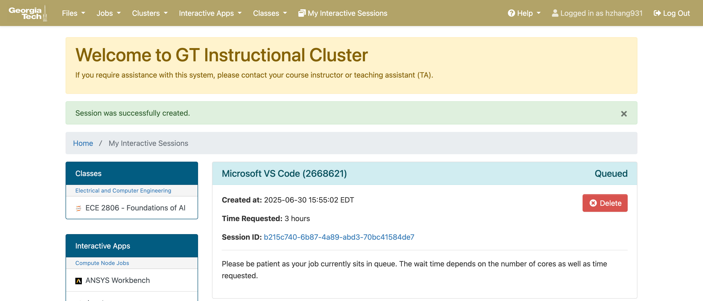
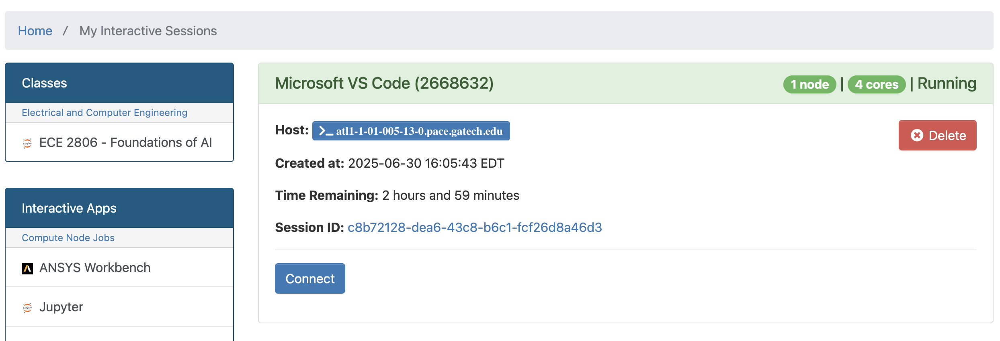
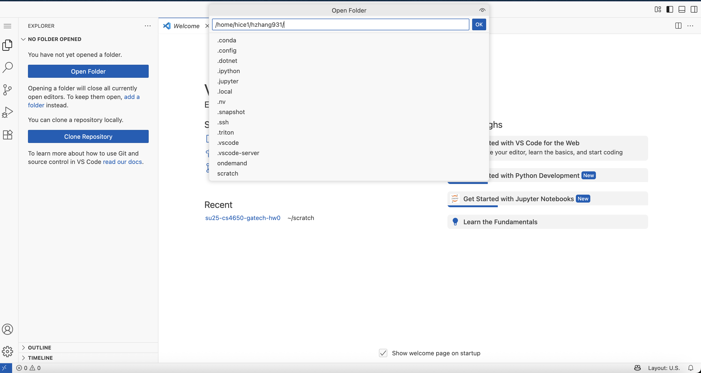

# PACE-ICE ESSENTIALS

*(A lot of the information here is taken from the tutorial made by Gururaj, which can be accessed here: https://github.com/guru-desh/Intro-To-PACE-ICE?tab=readme-ov-file)*

## Accessing PACE

You need to have the GT VPN Client installed to access PACE whether or not you are on eduroam.

Instructions on installing the GT VPN Client can be found below:
https://docs.pace.gatech.edu/gettingStarted/vpn/

Once connected to GT VPN, you can ssh into PACE using the command:

```bash
ssh <gtusername>@login-ice.pace.gatech.edu
```

*detailed instructions at: [PACE DOCUMENTATION](https://gatech.service-now.com/home?id=kb_article_view&sysparm_article=KB0042100)*

*You can also ssh from VSCODE: [VSCODE SSH](https://code.visualstudio.com/docs/remote/ssh)*

## Storage on PACE

**Personal** - The personal storage is storage that you as the user can claim to your name. It's pretty small at 15 GB, and can get filled very quickly. It is for this reason that we don't recommend using the personal storage at all.

**Scratch** - It can hold 300 GB of data. Note that:
- scratch storage is limited to you as the user. This means that if you have multiple collaboraters, then each collaborater would have to store the same data in their scratch storage.
- Data in the scratch storage is wiped after the semester ends. It is important that you have all your important data in the scratch directory backed up externally.

**Important!** Since Large Language Models can take up space very fast you should set the .cache symlink to a location inside scratch so that the default path where huggingface and Pytorch store model are in scratch. To do this, you can run the following command once you logging to PACE-ICE.

```bash
mkdir ./scratch/.cache
ln -s $(pwd)/scratch/.cache ~/.cache
```

## Interactive Jobs on PACE

### Using Open OnDemand

You can access OnDemand from this link:
https://ondemand-ice.pace.gatech.edu/pun/sys/dashboard

You have four tabs at the top. To create an interactive job, click on the Interactive Apps tab. The dropdown options are Jupyter, Matlab, VSCode, Interactive Shell. For this demonstration, let's assume that I will create a VSCode on PACE.



- You can leave the VSCode version and Environment Setup as default.
- You can specify the number of cores for the node. The maximum is 24.
- Memory per core determines the amount of RAM a node receives.
- Number of hours dictates how long you want this to run for. I usually request 3-4 hours in a single session.

**Important!** In Node Type, you can specify if you want a GPU node. Available types of GPUs include V100, RTX 6000, A100, A40, H100 etc. For HW0, you are going to load llama 3.1, Qwen 2.5, and phi-4 so a GPU with enough vRAM, ideally >= 40 GB, so we recommend creating a session with A40, A100, or H100. V100 32 GB should also suffice in most cases.

After starting the job, you will see this:



Sometimes when the resources are not immediately available, you will need to wait for a bit. If the session does not start after 10 minutes, we recommend deleting the session and creating a new one with a different kind of GPU.

Once the session has started, you can click 'Connect' (as shown below) to access the session. 



Once in the VSCode session, the interface is almost identical to a local VSCode window and you can use it the same way you work with VSCode on the desktop.



## Non-Interactive Jobs on PACE

Non-interactive jobs allow you to control SLURM, which is a scheduler that PACE uses to get you the compute you request for.

### Single Node CPU job

The two main important files are the .sbatch file and the other one is the file you want to execute, it can be a .sh or file in another scripting language such as .py. The .sbatch file is how you configure SLURM to get the correct configuration you want. The script actually executes the task.

An example .sbatch file would look like:

**run_task.slurm**

```bash
#!/bin/bash
#
#SBATCH --job-name=Task
#SBATCH --nodes=1 --ntasks-per-node=12
#SBATCH --time=6:00:00
#SBATCH --qos=coc-ice
#SBATCH --output=./logs/task.out
#SBATCH --mail-type=BEGIN,END,FAIL
#SBATCH --mail-user=username@gatech.edu

module load python/3.9.21             # your Python version
module load cuda                      # for H100 drivers, if needed

# go to your code directory and activate venv
cd ~/scratch/surprise_sae
source venv/bin/activate

export HF_HUB_TOKEN=*************

# run your job
srun python build_qwen_4b_cls.py
```

The configurations are defined in the #SBATCH lines. We define the job name, nodes, time, the quality of service, where to store the output log, and whether we want to receive emails or not.

Submit the job by running:

```bash
sbatch run_task.slurm
```

### Single Node GPU job

Running Single Node GPU Jobs is a simple change in the .sbatch file.

**run_task.slurm**

```bash
#!/bin/bash
#
#SBATCH --job-name=Task
#SBATCH --nodes=1 --ntasks-per-node=12 --gres=gpu:A100:1
#SBATCH --time=6:00:00
#SBATCH --qos=coc-ice
#SBATCH --output=./logs/task.out
#SBATCH --mail-type=BEGIN,END,FAIL
#SBATCH --mail-user=username@gatech.edu

module load python/3.9.21             # your Python version
module load cuda                      # for H100 drivers, if needed

# go to your code directory and activate venv
cd ~/scratch/surprise_sae
source venv/bin/activate

export HF_HUB_TOKEN=*************

# run your job
srun python build_qwen_4b_cls.py
```

The only line that was changed was this one:

```bash
#SBATCH --nodes=1 --ntasks-per-node=12 --gres=gpu:A100:1
```

Here, we add an extra tag to schedule a A100 GPU.

Submitting the job is again:

```bash
sbatch run_task.slurm
```

## Additional Resources

### Transferring Files to and from PACE

You can use scp or rsync as ways to transfer files to and from PACE.

The general command for using rsync to transfer files is as below:

```bash
rsync -a --progress <SOURCE COMPUTER>:<SOURCE FILES/FOLDER> <DESTINATION COMPUTER>:<DESTINATION FOLDER>
```

E.g. `rsync -a --progress requirements.txt hzhang931@login-ice.pace.gatech.edu:/home/hice1/hzhang931/scratch`

The general command for using scp to transfer files is as below:

```bash
scp -r -p -v <USER>@<SOURCE_HOST>:<SOURCE_PATH> <USER>@<DEST_HOST>:<DESTINATION_PATH>
```

E.g. `scp -r local_folder hzhang931@login-ice.pace.gatech.edu:remote_folder`

- `-r` Recursively copy entire directories
- `-p` Preserve modification times, access times, and modes
- `-v` Verbose mode (shows progress)